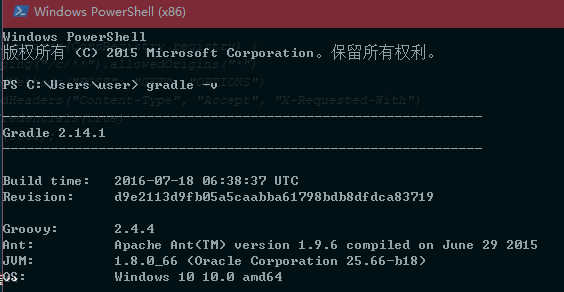
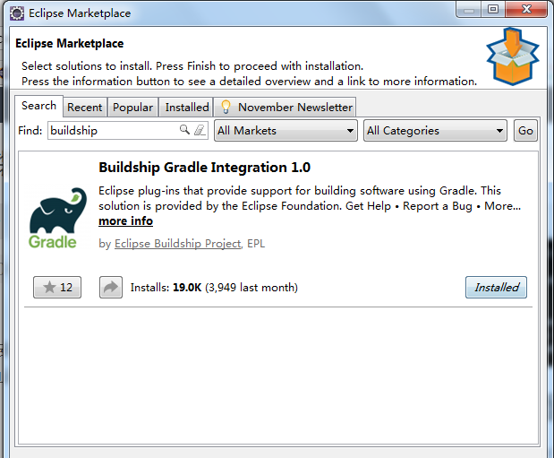
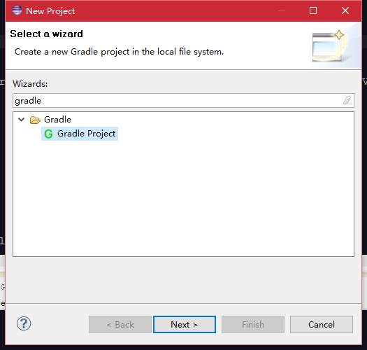
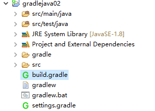
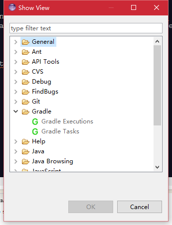
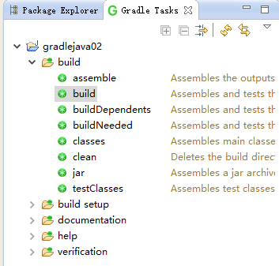

#### demo show

[点击查看演示地址](http://sauzny.github.io/ext/j/z3.html)

#### 一、简述
最近用java做了一个和图片相关的功能，发现了一个开源项目[cognitivej](https://github.com/CognitiveJ/cognitivej)，这个项目使用的是jdk1.8，gradle编译，所以学习了一下java8和gradle。

**需要**

*   Java 8
*   微软注册开发者key ([免费注册](https://www.microsoft.com/cognitive-services/))
*   依赖仓库JCente

#### 二、功能描述
基于CognitiveJ（Image Analysis in Java）做一个识别图片的webservice。包括五官标记，性别年龄，图片描述功能。

**使用技术**

| 技术名字 | 描述 |
|--------|--------|
| spring-boot | spring框架，提供web容器三种，tomcat（默认）、jetty、undertow，我使用的是undertow |
| gradle | 一种基于maven或者ant的打包工具 |
| bootstrap | 前端框架，封装了很多css+js的功能组件，插件丰富 |

#### 三、java相关

eclipse如不过不支持java8，可自行安装插件，eclipse中依次打开“Help”–》“Eclipse Marketplace”,在搜索栏中输入“java8”进行搜索

- ##### **java8时间工具包**

输出一个带有时区的时间戳：`LocalDateTime.now().toString()+ZonedDateTime.now().getOffset().toString();`
输出结果：`2016-08-30T10:57:11.544+08:00`

- ##### **获取applicationContext**

需要在一个不在spring容器中的类中引入一个spring管理的实例。
使用实例名字获取一个spring管理的实例。

启动函数：
```
@SpringBootApplication
public class Application {

	public static void main(String[] args) {

		final ApplicationContext applicationContext = SpringApplication.run(Application.class, args);

		//初始化时，记录applicationContext
		SpringUtils.setApplicationContext(applicationContext);
	}
}
```
SpringUtils：
```
public final class SpringUtils {

	private SpringUtils(){}

	private static ApplicationContext applicationContext;

	public static ApplicationContext getApplicationContext() {
		return applicationContext;
	}

	public static void setApplicationContext(ApplicationContext applicationContext) {
		SpringUtils.applicationContext = applicationContext;
	}

}
```

- ##### **spring boot 指定外部静态资源&&跨域设置**

```
@Configuration
public class MyWebAppConfigurer extends WebMvcConfigurerAdapter {

	@Autowired private CommonConfUtils commonConfUtils;

	/**
	 * 	方法描述:  静态资源映射
	 *
	 *  @author : ljx 创建时间 2016年8月26日 上午11:04:24
	 */
	@Override
    public void addResourceHandlers(ResourceHandlerRegistry registry) {

        registry.addResourceHandler("/tempUpPath/**")
        	.addResourceLocations("file:///"+commonConfUtils.getTempUpPath());

        registry.addResourceHandler("/tempDownPath/**")
        	.addResourceLocations("file:///"+commonConfUtils.getTempDownPath());

        super.addResourceHandlers(registry);
    }

	/**
	 * 	方法描述:  跨域设置
	 *
	 *  @author : ljx 创建时间 2016年8月26日 下午3:36:16
	 */
	@Override
	public void addCorsMappings(CorsRegistry registry) {
		registry.addMapping("/c/**").allowedOrigins("*")
				.allowedMethods("POST", "GET", "OPTIONS")
				.allowedHeaders("Content-Type", "Accept", "X-Requested-With")
				.allowCredentials(true)
				.maxAge(3600);
	}

}
```

#### 四、gradle

- ##### **win-gradle安装**
[官网下载地址](https://gradle.org/gradle-download/)
选择Complete distribution (binaries, sources and offline documentation)
配置环境变量`C:\gradle-2.14.1\bin`
检查配置结果`gradle -v`


- ##### **eclipse-gradle插件的使用**

1.eclipse中依次打开“Help”–》“Eclipse Marketplace”,在搜索栏中输入“buildship”进行搜索；


2.点击install，等待安装完成，按照提示重启eclipse即可。

3.安装成功后，可以在Window–>Show View–>Others…中和File–>New–> Other…中看到增加的Gradle选项。配置gradle的目录。

4.在eclipse中创建gradle-progect，new project选择 gradle， 一直下一步。

创建项目结果

调整eclipse试图，在Window–>Show View–>Others…中选择 gradle task

在gradle task视图中，build可以编译项目，项目根目录下生成build文件夹


- ##### **gradled的配置文件build，引入依赖，排除依赖，设置字符集**
build.gradle

```


```

#### 五、web前端

- bootstrap fileupload 插件的使用
- http跨域问题

#### 六、遗留问题

- 对java8的使用，学习lambda表达式以及其他新的特性，使用在代码中
- spring-boot的定时任务，增加对临时文件目录的监控，压缩或者删除文件，避免磁盘占用过多
- 对gradle的学习，配置文件中的个属性的作用，编写自己的Groovy脚本

**列出问题，详细信息之后继续补充**